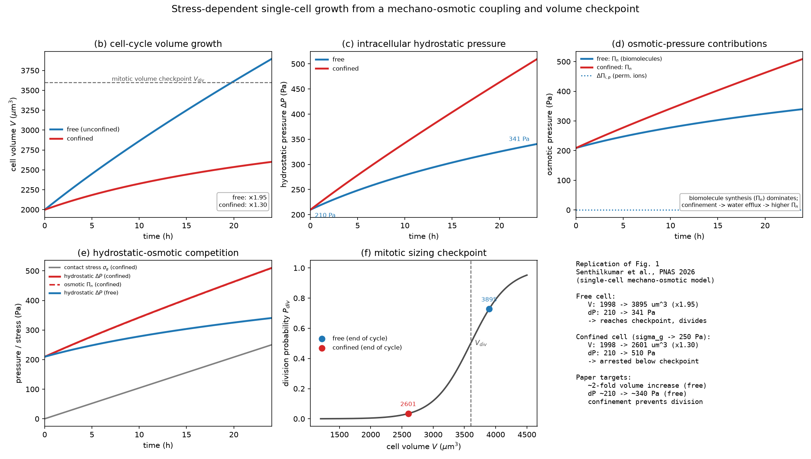
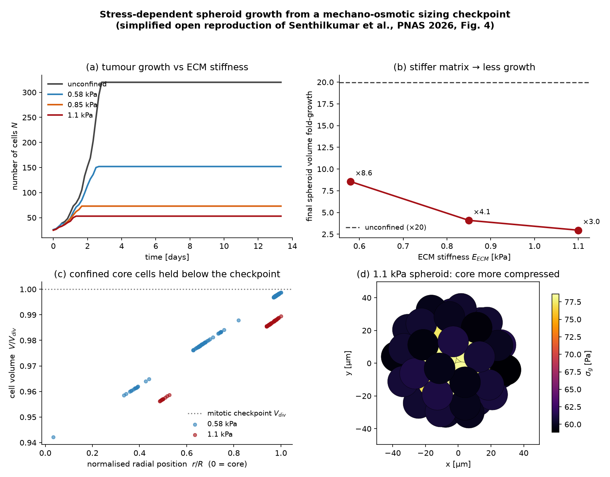
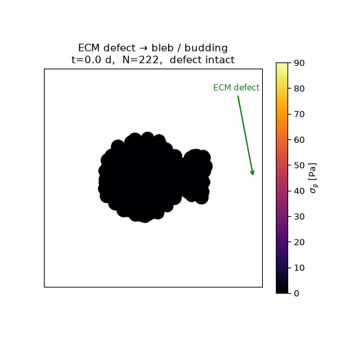

# Replication: mechano-osmotic growth and the cell-volume checkpoint

A from-scratch reimplementation of the **single-cell hydromechanical growth
model** (Figure 1), plus a **simplified open reproduction of the multicellular
stress-dependent spheroid-growth result** (≈Figure 4), of:

> I. Senthilkumar, J. Vangheel, V. Kumar, L. McNamara, B. Smeets, E. Howley,
> E. McEvoy, *"Stress-dependent growth in breast cancer arises from a
> mechano-osmotic coupling and cell-sizing checkpoint"*, **PNAS** 123(10):
> e2523159123 (2026). doi:[10.1073/pnas.2523159123](https://doi.org/10.1073/pnas.2523159123)
>
> Open-access preprint: *"Stress-dependent growth of breast cancer models
> arises from a cellular volume checkpoint"*, bioRxiv
> [2025.07.29.667388](https://doi.org/10.1101/2025.07.29.667388).

This repository reproduces the paper's central single-cell result: **cell-cycle
volume growth is driven by osmotic pressure from biomolecule synthesis, and
mechanical confinement disrupts the hydrostatic–osmotic balance, holding the
cell below a critical volume checkpoint for mitosis** (Fig. 1b–f).



## Result

For a single HeLa cell over a 24 h G1→M cycle, the model reproduces the
paper's documented anchors:

| quantity | paper (Fig. 1) | this replication |
|---|---|---|
| free-cell volume increase | "almost two-fold" | **×1.95** |
| free-cell hydrostatic pressure | ~210 → ~340 Pa | **210 → 341 Pa** |
| dominant osmotic contribution | biomolecule synthesis Πₙ | **Πₙ ≫ ΔΠᵢ,ₚ** (340 vs 0.75 Pa) |
| confinement (σ_g → 250 Pa) | growth arrest below checkpoint | **×1.30, stays < V_div** |
| confinement effect on ΔP | raises hydrostatic pressure | **510 Pa vs 341 Pa** |

`python src/validate.py` checks all of these automatically (7/7 pass).

## The model

The cell is described during its cycle by three quantities: the amount of
impermeable biomolecules `n_n` (the slow growth driver), the cell volume `V`,
and the amount of permeable ions `N`.

**Osmotic pressures** (van't Hoff, dilute):

```
Πₙ      = n_n R T / V                     (impermeable biomolecules)
Πᵢ,ₚ    = N   R T / V                     (permeable ions, internal)
ΔΠᵢ,ₚ   = Πᵢ,ₚ − Π_ext                    (permeable-ion difference)
ΔΠ      = (n_n + N) R T / V − Π_ext = Πₙ + ΔΠᵢ,ₚ
```

**Water flux across the semi-permeable membrane** (paper Eq. 1):

```
dV/dt = − A · L_p,m · (ΔP − ΔΠ)
```

**Cortex mechanics** — force balance for a sphere of radius `r`
(McEvoy et al. 2020):

```
σ  = (K/2)(r²/r₀² − 1) + σ_a              (cortical stress: passive + active)
ΔP = σ_g + 2 h σ / r                       (intracellular hydrostatic pressure)
```
where `σ_g` is the external contact/confinement stress.

**Permeable-ion transport** — mechanosensitive + leak channels + active pump
(paper Eq. 2):

```
dN/dt = − A · [ (ω_ms(σ) + ω_l + γ) ΔΠᵢ,ₚ − γ ΔΠ_c ]
ω_ms(σ) = 0                         if σ ≤ σ_c
        = ω_ms (σ − σ_c)            if σ_c < σ < σ_s
        = ω_ms (σ_s − σ_c)          if σ ≥ σ_s
```

**Biomolecule synthesis** — the growth driver (saturating by macromolecular
crowding):

```
dn_n/dt = β     while n_n < n_sat,   else 0
```

**Mitotic sizing checkpoint** (paper Methods, after Varsano et al. 2017):

```
P_div(V) = λ / (1 + exp(−α (V/V_div − 1)))
```

### Why confinement arrests growth (the mechanism)

The permeable ions adjust quickly so that `ΔΠᵢ,ₚ` sits at its pump–leak steady
state (~1 Pa) — they osmotically balance the large external pressure `Π_ext`
(~0.67 MPa) almost exactly. Growth is therefore governed by the **small** (few
hundred Pa) balance between the biomolecule osmotic pressure `Πₙ`, the cortical
hydrostatic pressure, and any contact stress:

```
Πₙ(V) ≈ ΔP(V) − ΔΠᵢ,ₚ  =  σ_g + 2 h σ(r)/r − ΔΠᵢ,ₚ
```

Synthesis raises `n_n`, pulling water in and growing the cell; the cortex
stiffens as it stretches, raising `ΔP` (this is the observed 210→340 Pa rise).
Adding a confinement stress `σ_g ≈ 250 Pa` is **comparable to `Πₙ` itself**, so
it drives water efflux and holds the cell below the mitotic volume checkpoint —
even though 250 Pa is negligible against the 0.67 MPa osmotic background. This
is exactly the "competition between hydrostatic forces and osmotic pressure
from biomolecule synthesis" described in the paper.

### Numerics

Water and ion equilibration (seconds–minutes) are fast compared with synthesis
(hours), so the cell tracks a **quasi-static** balance `ΔP = ΔΠ` while only
`n_n` evolves slowly. `single_cell_model.simulate()` integrates `n_n(t)` and
solves the algebraic balance for `V` at each step. `simulate_full_ode()`
integrates the full stiff three-state ODE system and agrees with the
quasi-static reduction to ~1% (checked by `validate.py`).

## Parameters and provenance

The PNAS Supplementary Information (parameter tables) and the authors' code
were **not publicly available** at the time of writing (the preprint states
code/data will be released on GitLab at publication). Parameters are therefore
grounded as follows — see `src/parameters.py` for the per-value annotations:

* **Membrane/ion machinery and cortex mechanics** (`Π_ext`, `K`, `σ_a`, `h`,
  `ω_ms`, `ω_l`, `γ`, `ΔΠ_c`, `σ_c`, `σ_s`) are taken from **Supplementary
  Table 1 of McEvoy, Han, Guo & Shenoy (2020)**, *Nat. Commun.* 11:6148,
  doi:[10.1038/s41467-020-19904-5](https://doi.org/10.1038/s41467-020-19904-5)
  — the open-access predecessor model that the 2026 paper extends and cites.
* **Geometry (`r₀`), the synthesis parameters (`β`, `n_sat`, `n_n0`) and the
  confinement protocol** are **calibrated** to the single-HeLa-cell anchors the
  2026 paper reports (≈2-fold volume growth; ΔP ≈ 210→340 Pa; σ_g ramped to a
  250 Pa peak at 24 h). This mirrors the paper, which itself calibrates the
  growth curve to HeLa single-cell data (Cadart et al. 2022).

This is an honest, mechanism-faithful replication of the model and its central
result; absolute parameter values that depend on the unpublished SI are
calibrated to the paper's stated targets rather than copied.

## Multicellular spheroid: stress-dependent growth (≈Fig. 4)

The paper's headline tissue-scale result is that **a stiffer extracellular
matrix (ECM) suppresses tumour growth**, because confinement raises hydrostatic
stress and holds cells below the same mitotic volume checkpoint. The authors
produce this with a discrete deformable-cell ("active foam") spheroid simulation
on the proprietary **Mpacts** engine, an **Abaqus** finite-element ECM model, and
a **neural-network surrogate** for the ECM response (their code:
[KU Leuven GitLab](https://gitlab.kuleuven.be/mebios-particulate/publications/stress-dependent-growth-in-breast-cancer-arises-from-a-mechano-osmotic-coupling-and-cell-sizing-checkpoint),
which requires Mpacts + Abaqus and renders movies in ParaView — not runnable
from scratch openly).

`src/spheroid_model.py` is a **lightweight, fully open** stand-in that keeps the
*mechanism the paper credits the result to* and drops the heavy machinery:

* each cell is a soft sphere whose volume comes straight from the **single-cell**
  mechano-osmotic balance `solve_state(n_n, σ_g)`;
* cells synthesise biomolecules, then **divide stochastically** once past the
  volume checkpoint `P_div(V)`;
* the spheroid grows inside an **elastic–plastic ECM cavity**: as it outgrows the
  matrix, the matrix resists with a pressure `σ ∝ E_ECM · overstrain`, which the
  cells feel as the confinement stress `σ_g` — closing the mechano-osmotic loop
  at tissue scale. Interior cells end up more compressed than rim cells (the
  paper's spatial cell-volume variation).



Running three ECM stiffnesses (the **0.58 / 0.85 / 1.1 kPa** used by the paper's
AI surrogate) plus an unconfined control reproduces the stress-dependent-growth
trend (`validate.py` checks it; 4/4 pass):

| ECM stiffness | final cells `N` | fold volume growth | mean `σ_g` |
|---|---|---|---|
| unconfined | 320 (cap) | ×20 | 0 Pa |
| 0.58 kPa | 152 | ×8.6 | 59 Pa |
| 0.85 kPa | 73 | ×4.1 | 62 Pa |
| 1.1 kPa | 53 | ×3.0 | 64 Pa |

`src/animate_spheroid.py` renders the growth as a movie
(`figures/spheroid_growth.gif`), cells coloured by compressive stress.

> **This is a reduced model, not the authors' simulation.** It is calibrated to
> reproduce the qualitative stiffness-dependent-growth *trend* and the spatial
> compression pattern — not the paper's exact spheroid geometry, cell-resolved
> deformation, or ECM finite-element fields. The tissue-scale mechanical
> constants (`c_wall`, `plastic`, `phi_max`, …) are a single shared calibrated
> set; only `E_ECM` changes between conditions. See `src/spheroid_model.py` for
> the full derivation and assumptions.

## Local ECM defect → budding

`src/spheroid_bleb.py` is an exploratory extension (not in the paper) enabled by
making the confinement **spatially resolved** instead of mean-field. A growing
spheroid is held in a matrix cavity, then a **local defect** — an angular patch
where the confining stiffness drops to ~0 (a hole in the ECM) — is opened. With
the wall gone there, the internal pressure is unbalanced, so cells are extruded
through the defect; and because they feel no confinement, they pass the volume
checkpoint and keep proliferating, extending a **bud** while the confined bulk
stays arrested. Cohesion (surface tension) keeps the bud a connected protrusion.



The bulk (bright, σ_g ≈ 320 Pa, arrested, compressed cells) and the unconfined
bud (dark, σ_g ≈ 0, full-size proliferating cells) separate cleanly. This uses a
genuine force-based cell model (repulsion + cohesion + a defective boundary) and
a sharper tissue-scale sizing checkpoint; it is an illustration of the mechanism,
not a calibrated result.

## Usage

```bash
pip install -r requirements.txt
python src/single_cell_model.py   # prints the growth/pressure trajectory
python src/figure1.py             # writes figures/ (Fig. 1b–f + combined)
python src/spheroid_model.py      # prints the ECM-stiffness growth sweep
python src/figure4.py             # writes figures/figure4_spheroid.png
python src/animate_spheroid.py    # writes figures/spheroid_growth.gif
python src/spheroid_bleb.py       # writes figures/spheroid_bleb.gif (ECM-defect bud)
python src/validate.py            # checks both reproductions (11/11)
```

## Scope and honesty

* **Single-cell model (Fig. 1):** a faithful, mechanism-level replication; the
  authors did **not** publish this part's code, so it is independent.
* **Spheroid result (≈Fig. 4):** a **simplified open reproduction** of the
  *trend and mechanism*. The authors' actual multicellular code is public but
  depends on proprietary Mpacts + Abaqus and a trained DNN surrogate, so it is
  not openly runnable; this repo substitutes an open particle model.
* **Not attempted:** the DNN-accelerated finite-element ECM solver itself, the
  cell-resolved deformable-cell mechanics, and the T47D/4T1 wet-lab experiments.

## Repository layout

```
src/parameters.py          single-cell parameter set with per-value provenance
src/single_cell_model.py   single-cell model (quasi-static + full-ODE, checkpoint)
src/figure1.py             reproduces Figure 1b–f
src/spheroid_model.py      simplified open multicellular spheroid model (≈Fig. 4)
src/figure4.py             reproduces the stress-dependent-growth figure
src/animate_spheroid.py    renders the spheroid-growth movie (GIF)
src/spheroid_bleb.py       local-ECM-defect budding model + movie (extension)
src/validate.py            quantitative checks for both models (11/11)
figures/                   generated figures and animations
```
